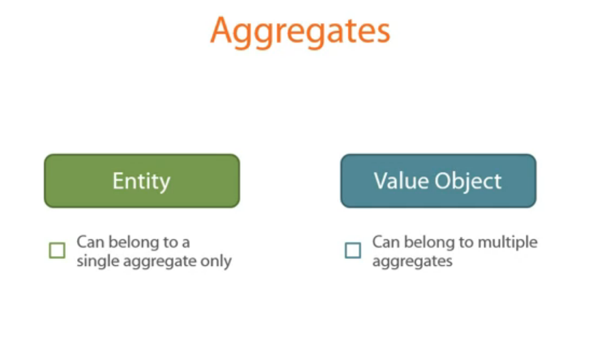

# Extending the Bounded Context with Aggregates

**Aggregate** is a Design Pattern. It gather multiple *Entities**
under a single abstraction

A DDD aggregate is a cluster of domain objects that can be treated as a single unit

Every **Aggregate** should have a **Root Entity** which is the main **Entity**

Classes outside an **aggregate** can only reference the **Root Entity**

Restricting access to the Aggregate entities helps protect the Aggregate invariance

Ideally, there should be no-way for the client code to break the aggregate invariance and thus corrupt its internal state

Aggregates act as single operational unit for the code in your **Application layer**

The data in database that belongs to a single aggregate should be consistent. To achieve this we need to persist an aggregate in a transactional manner.

## Boundaries for Aggregates

## Further readings

<http://bit.ly/1lisDBQ>
