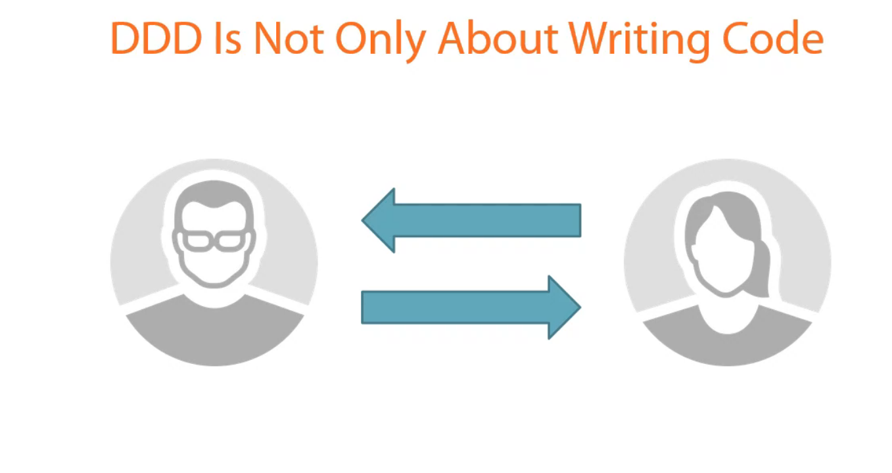
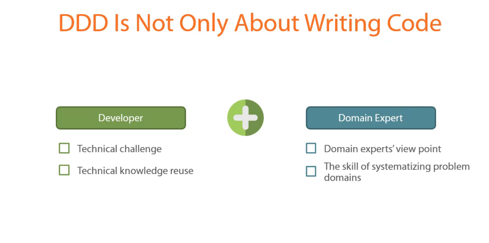
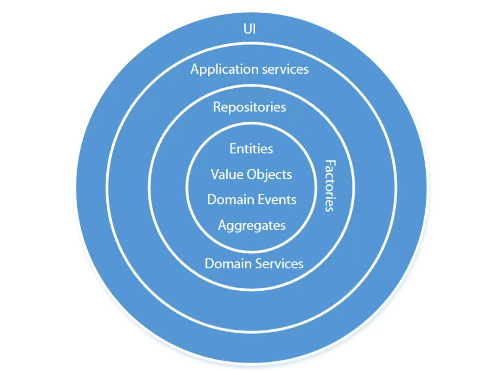
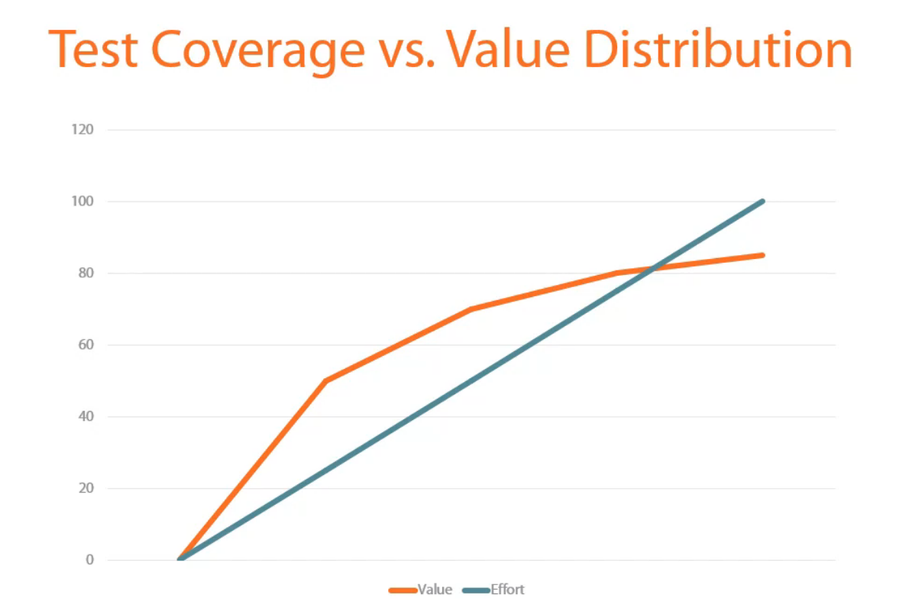

# Area of application for Domain Driven Design

Software Project

Area | DDD
-- | --
Amount of Data | NO
Performance | NO
Business Logic complexity | YES
Technical complexity | NO

## Why DDD

### YAGNi

You are not gonna need it
Shortening development time

### KISS

Keep it short and simple
Maintainable code

### DDD

Focus on essential parts
Simplifying the problem

## Main concepts of Domain Driven Design

Strategic elements of DDD

### Ubiquitous language

Bridges the gap between developers and experts

### Bounded context

Clear boundaries between different parts of the system

### Core domain

Focus on the most important part of the system

### DDD is not only about writing Code

Solve the problems in the simplist way

Constently work with the experts and strive to help them simplify or even rethink the problem

Code should help

Software developers must strive to become domain experts themselves

## Onion Architecture

Core part Isolated

Seperation of concerns

Entity | Domain Event | Value Object | Aggregate

Represent the Domain knowledge (only thing)

**NO** Persistence

**NO** Construction

**NO** Mapping to the DB

Keep a clean domain model

Proper seperation of concerns

Deal with ORM side effects

## Modeling best practices

Focus on the core domain

## Domain Driven Design and Unit Testing

Unit tests for Core domain part

integration tests for Repositories, Factories, Application services to cover several pieces of application at once

<http://bit.ly/1hT842g>
