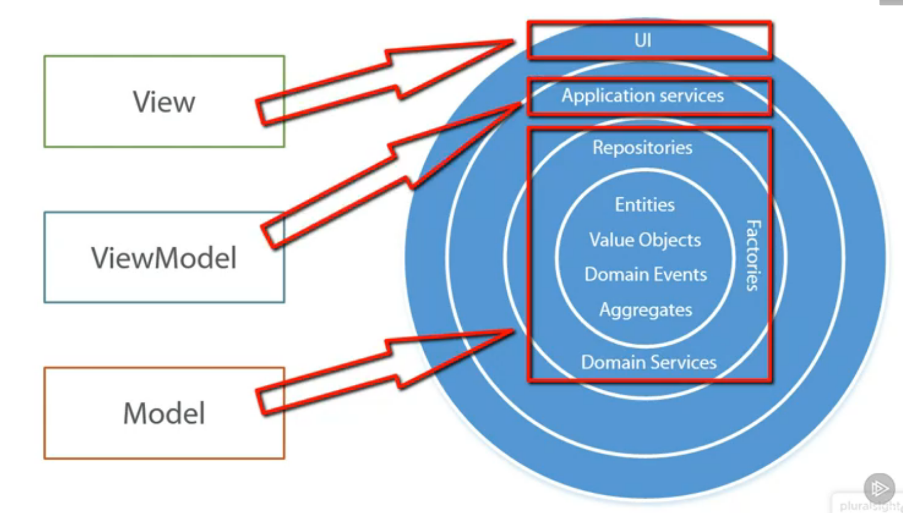
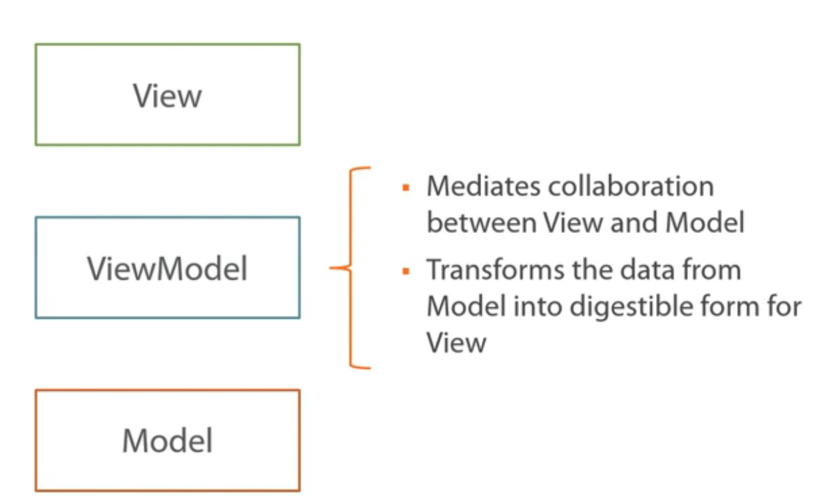
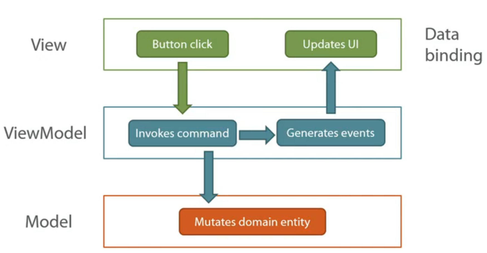
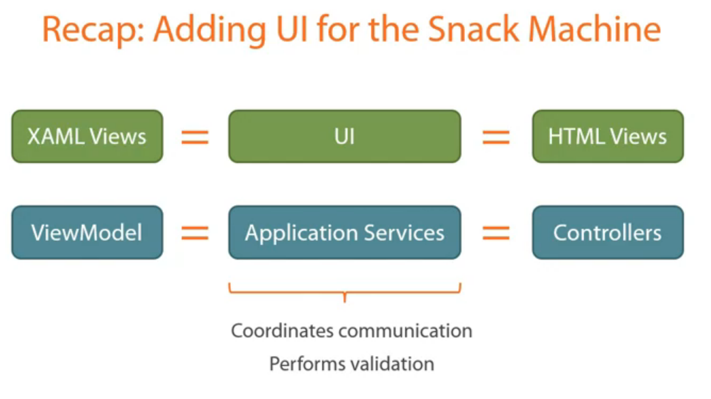
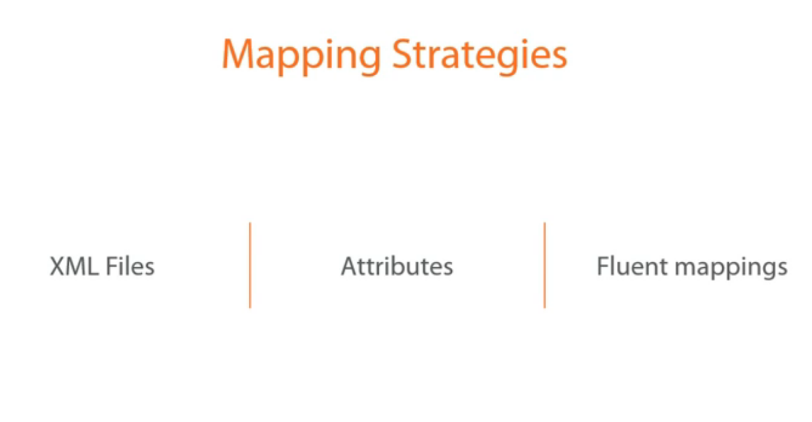
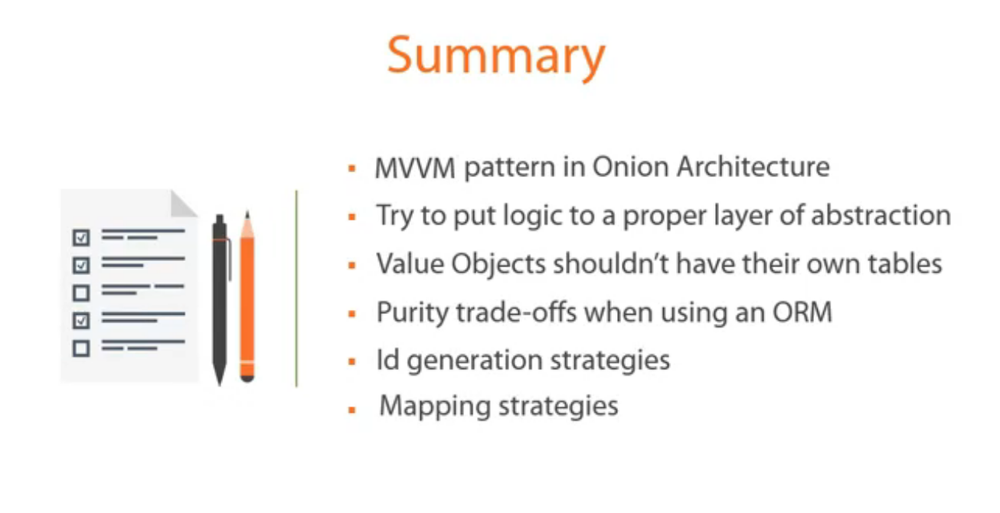

# Introducing Ui and Persistence Layers

## Data Binding

Commands and events enable smooth communication between models and views

Data binding enables loose coupling between models and views

If the piece of logic to add make sense only in the context of UI then place it in the ViewModel, else place it in the domain part

The lifetime of the ValueObject should fully depend on the lifetime of the Entity

## Id Generation Strategies

Auto increment ID

GUID

Hi/Lo: <http://bit.ly/1l4ablz>

XML mapping is hard to maintain

Attributes is much better, but it violates the **single responsibility principle**
i.e. the isolation of the domain layer which should be responsible to represent the domain knowledge.
And with the attributes, these classes will depend on third party packages (entities will know how they will be stored)

Fluent Mapping is best solution as it helps to isolate the domain layer

## Composition Root

A Composition Root is a (preferably) unique location in an application where modules are composed together.

## Further readings

<https://blog.ploeh.dk/2011/07/28/CompositionRoot/>
