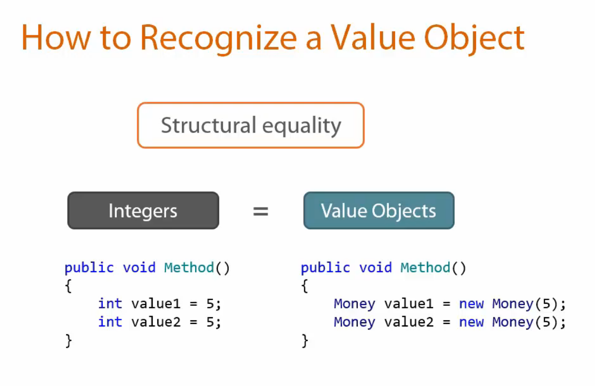
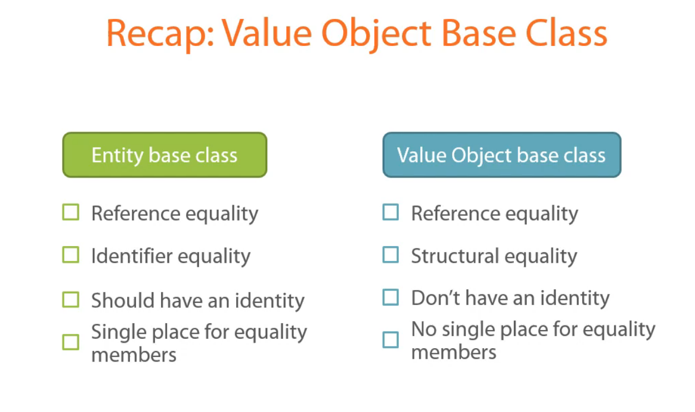
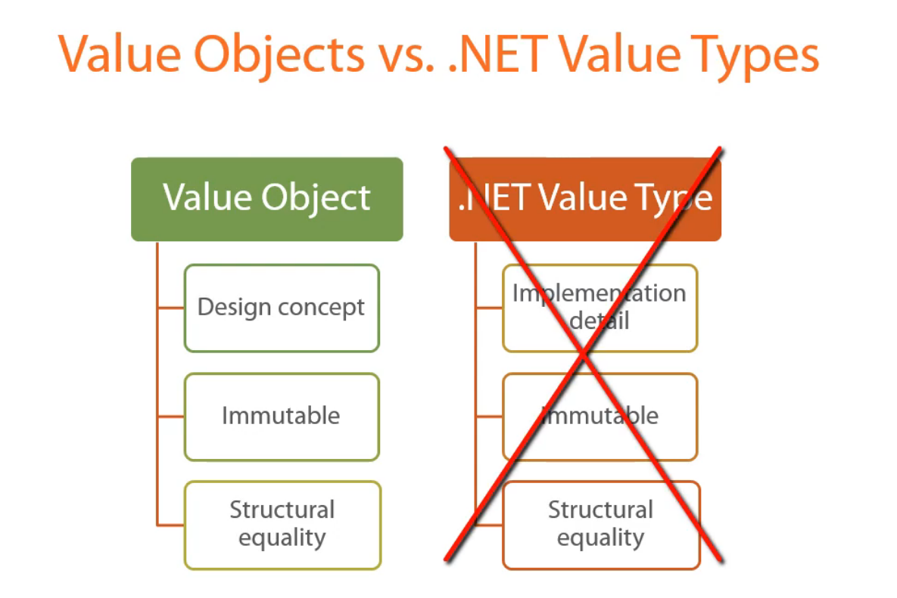

# Starting with the first bounded context

Start with the core domain

Don't introduce several bounded contexts upfront

Always look for hidden abstractions

Snack Machine = Entity

Money = Value Object

## Types of Equality

### Identifier equality

Two objects are equal if they have the same **identifiers** aka ids

### Reference equality

Two objects are equal if they the same address at memory

### Structural equality

Two objects are equal if all of their members match

### Value Objects

Don't have an Id field
Can be treated interchangeably
Immutable
Cannot live by they own
Belong to one or several entities
Don't have their own table
**Structural equality**

### Entities

Must have Id
Mutable
Own value objects
**Identifier equality**



``Prefer Value Object over Entity``

## Entity Base Class

Using an interface is a bad choice

```csharp
public interface IEntity
{
  int Id { get; }
}
```

- Code duplication (in every single entity). Which is a heavy violation to the **DRY: Don't repeat yourself** principle
- Doesn't show proper relations between entities

### BAD

``Can Do relationship``

```csharp
public interface IEntity {}
public class Entity1: IEntity {}
public class Entity2: IEntity {}
```

### GOOD

``Is a relationship``

```csharp
public abstract class IEntity {}
public class Entity1: IEntity {}
public class Entity2: IEntity {}
```

### Have an ID

### Equality members in the Base Class

## Value Object Base Class

### Don't have an ID

### Can't place equality members to the Base Class




## When to write Unit Tests


Two Modes in which we write code:

- Sure about what to do with the code. So, create Unit Tests upfront before starting implementing the core functionality

- Experimenting and Unit Tests slows down the productivity

### Further Readings

<https://martinfowler.com/bliki/ValueObject.html>
<http://bit.ly/1FSzTg1>
<http://bit.ly/1XF0J6H>
